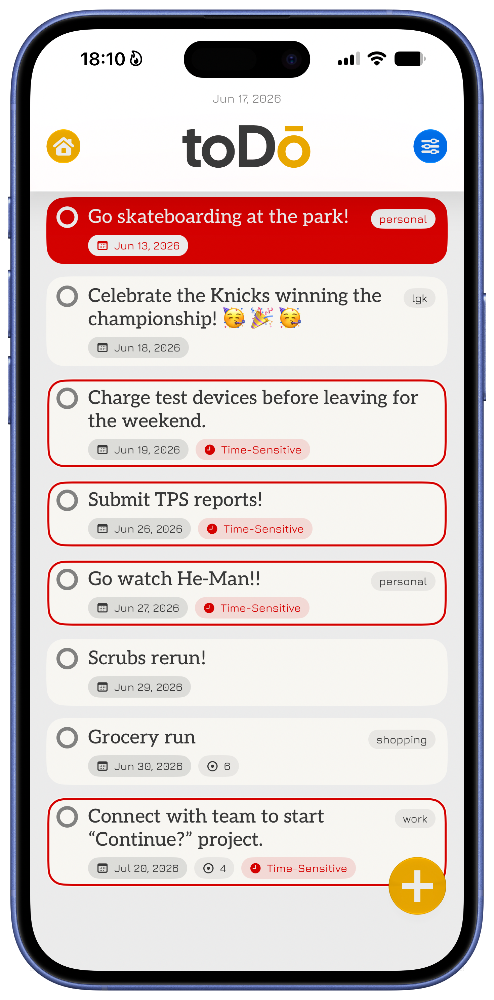
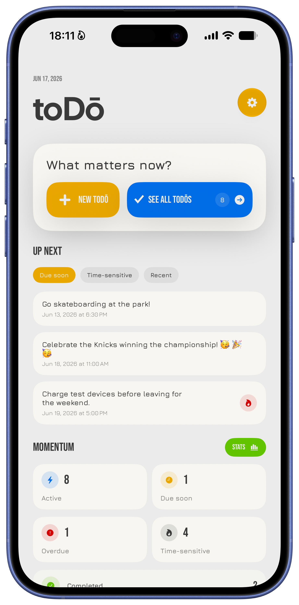
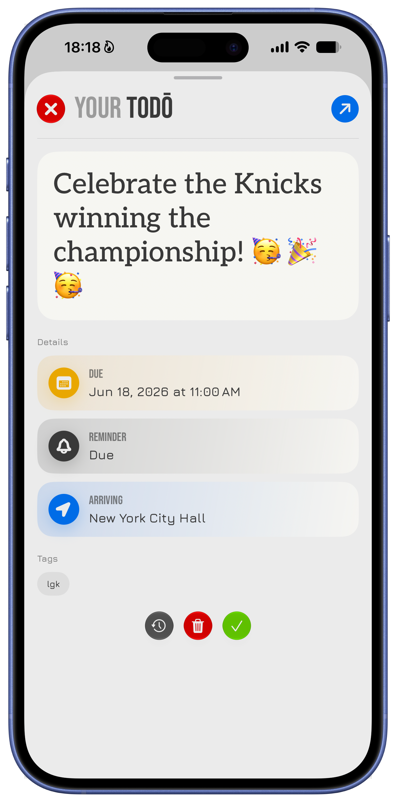
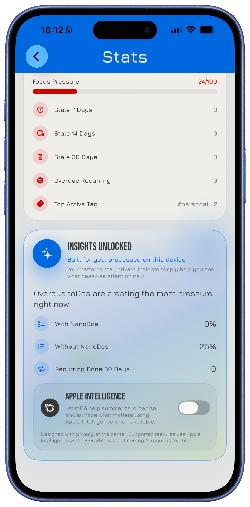
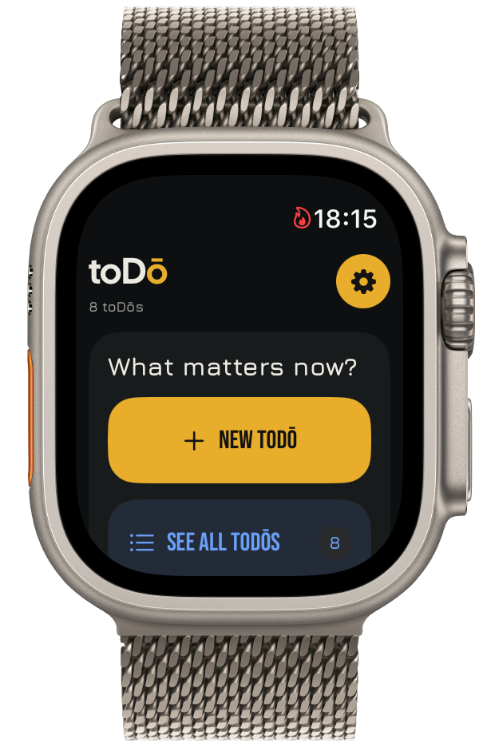

# toDō

A productivity system for the user.

  
  
  
  
  

---

## What is toDō?

toDō is a task management application built around a simple premise: productivity software should help people make progress, not become another thing that requires management.

The project began as a personal effort to create a reliable system for managing responsibilities during a period when memory, cognition, and consistency became distinctly unreliable. Existing tools either felt too complicated, too rigid, or too disconnected from the way responsibilities accumulate and evolve in everyday life. What started as a personal solution gradually evolved into a broader exploration of how software can help people build structure, maintain momentum, and follow through on meaningful work.

Many productivity applications attempt to solve every organizational problem imaginable. Over time, they accumulate features, settings, hierarchies, and workflows that often become work themselves. toDō takes a different approach. The project intentionally prioritizes clarity, execution, and long-term usability over feature accumulation. New functionality is expected to justify its existence by reducing friction, improving understanding, or helping users move forward.

Today, toDō serves as both a production application and an ongoing software engineering project focused on intentional design, platform integration, accessibility, and sustainable long-term development.

---

## Repository Status & Source Code Availability

This repository contains the source code for the production version of toDō.

The source code is publicly available to:

- Share architectural and engineering decisions
- Encourage technical discussion
- Document the evolution of the project
- Accept bug reports and community contributions
- Serve as a public portfolio of the work

The repository exists as a transparent record of how the application is designed, built, and maintained. Architectural discussions, bug reports, accessibility improvements, documentation updates, and targeted pull requests are welcome when they align with the direction of the project.

While the source code is publicly available, toDō remains a proprietary commercial application. Please review the [accompanying license](LICENSE) before using, modifying, or contributing to the project.

---

## Philosophy & Design

The design of toDō is guided by a small number of principles that influence both product and engineering decisions.

### Simplicity Before Features

toDō intentionally resists feature accumulation. New functionality should reduce friction, improve clarity, or solve a specific problem. Features that increase complexity without creating meaningful value are unlikely to be adopted.

### Structure Encourages Action

The objective is not to help users manage more tasks. The objective is to help users complete the tasks that matter. Product decisions should support momentum, follow-through, and intentional action rather than endless organization.

### Native Experiences Matter

Modern platforms provide powerful capabilities that should be embraced rather than abstracted away. Widgets, Live Activities, App Intents, notifications, and platform-specific interactions are treated as first-class experiences because they allow the software to integrate naturally into a user's workflow.

### Maintainability Is a Feature

Software intended to exist for years should be designed with long-term maintenance in mind. The project favors straightforward solutions, sustainable architecture, and clear ownership of responsibility over unnecessary abstraction and short-lived trends.

---

## Architecture

toDō is built primarily with SwiftUI and SwiftData and follows a lightweight architecture focused on maintainability, performance, and platform integration.

The application adopts a local-first approach to task management. Core functionality remains available regardless of network connectivity, while synchronization services enhance the experience rather than define it. Users can choose workflows that best fit their needs, whether operating locally or synchronizing across supported services.

A significant amount of development effort has gone into ensuring that the application feels at home on every platform it supports. Rather than treating platform-specific capabilities as optional enhancements, integrations such as Widgets, Live Activities, App Intents, notifications, and Apple Watch support are considered core parts of the overall experience.

### Technology Stack

#### Languages & Frameworks

- Swift 6
- SwiftUI
- SwiftData

#### Data & Synchronization

- CloudKit
- Supabase

#### System Integration

- WidgetKit
- ActivityKit
- App Intents
- UserNotifications

#### Development Environment

- Xcode 27 Beta
- iOS 27
- iPadOS 27
- watchOS 27

---

## Current Capabilities

The current release includes:

- Task management with due dates and reminders
- Recurring tasks with automatic regeneration
- NanoDos for breaking down larger efforts
- Tagging, organization, and progress statistics
- Native platform integrations (Widgets, Live Activities, App Intents, Apple Watch)
- Flexible synchronization (Local-only, iCloud, Supabase)

The project continues to evolve as new platform capabilities emerge and opportunities for improving the overall experience are identified.

---

## Documentation

Additional repository documentation can be found here:

- [CONTRIBUTING.md](CONTRIBUTING.md)
- [SECURITY.md](SECURITY.md)
- [LICENSE](LICENSE)

---

## Creator

Created, designed, developed, and maintained by Moinuddin Ahmad.

toDō began as a personal solution to a practical problem and has grown into an ongoing exploration of productivity, structure, momentum, and intentional software design.

[iamshift.dev](https://iamshift.dev)
